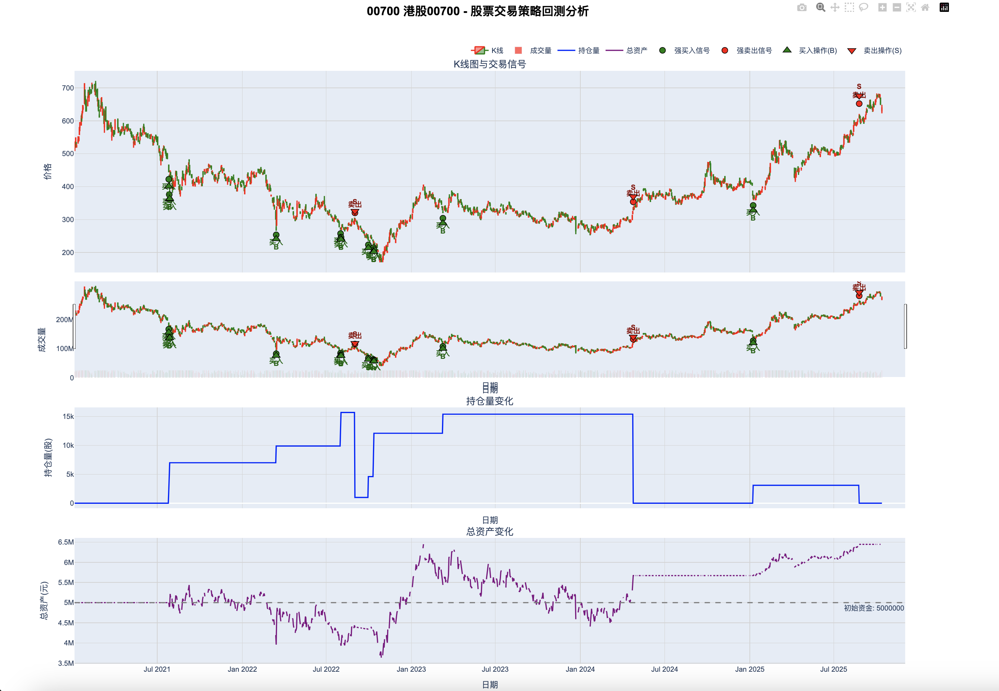

[English](./README.md) | [简体中文](./README_zh-CN.md)

---
# stock-quant 本地回测
## 环境依赖安装
- Python3 [官网](https://www.python.org/downloads/macos/)
```
MacOS:官网下载python3安装包，直接安装即可，也可以配置多个版本的python3环境，支持自由切换，
切换方式查看环境初始化部分
```

## 环境初始化
- Python3.13（推荐）
```
python3.13 -m venv venv13 
source venv13/bin/activate
pip install -r requirements-13.txt

```
- Python3.7（暂未测试）
```
python3.7 -m venv venv7 
source venv7/bin/activate
pip install -r requirements-7.txt
```
- Python环境切换
```
- deactivate
```

## 快速开始
### 1. 历史k线数据准备
```
运行core/stock/manager_xxxx，获取k线数据
```
### 2. 回测运行
```
from common.logger import create_log
from core.quant.quant_manage import run_backtest_enhanced_volume_strategy, run_backtest_enhanced_volume_strategy_multi
from core.strategy.trading.volume.trading_strategy_volume import EnhancedVolumeStrategy
from settings import stock_data_root

logger = create_log('test_strategy')

if __name__ == "__main__":
    # 启动回测-单个股票
    kline_csv_path = stock_data_root / "futu/HK.00175_吉利汽车_20211028_20251027.csv"
    run_backtest_enhanced_volume_strategy(kline_csv_path, EnhancedVolumeStrategy)
    # 启动回测-批量股票
    kline_csv_path_folder = stock_data_root / "akshare"
    run_backtest_enhanced_volume_strategy_multi(kline_csv_path_folder, EnhancedVolumeStrategy)
```
### 3. 回测结果分析
```
回测日志会输出到logs目录下
回测图表会输出到html目录下（历史k线、策略触发信号、策略交易记录、持仓记录、资金记录）
```

### 4. 策略参数调整
```
调整策略信号参数（只标记交易信号，不交易）：settings文件中修改交易策略相关参数
调整策略买卖参数（根据交易信号执行交易）：settings文件中修改交易佣金相关参数
调整初始本金：settings文件中修改交易本金参数
```

声明：策略仅用于学习和研究，不建议在真实交易中使用，不承担任何交易风险，后果自负